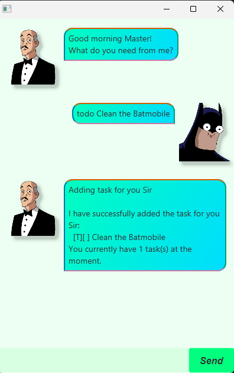
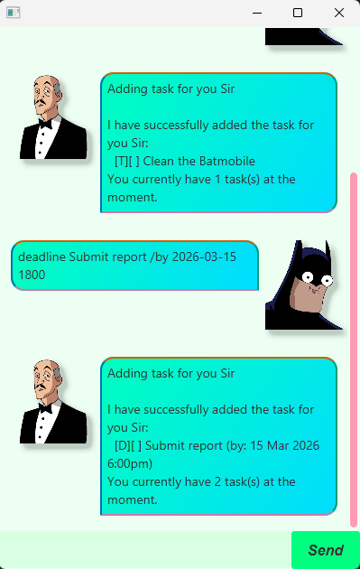
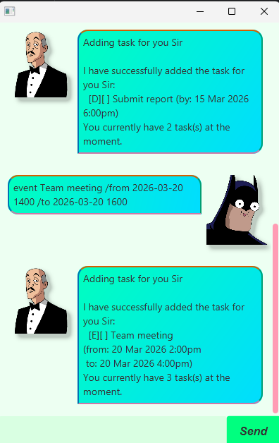
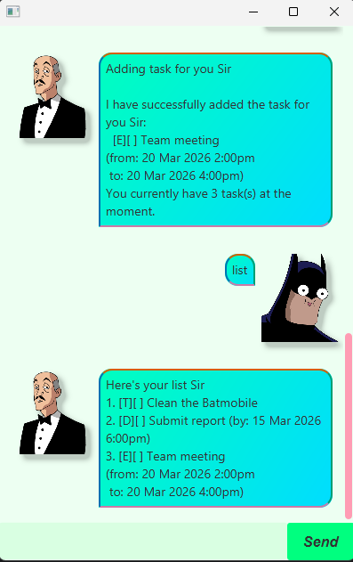
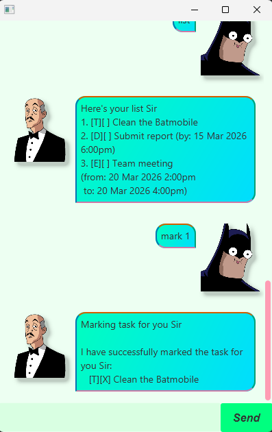
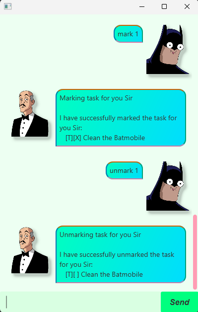
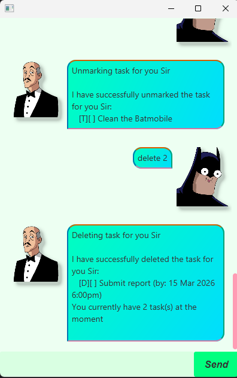
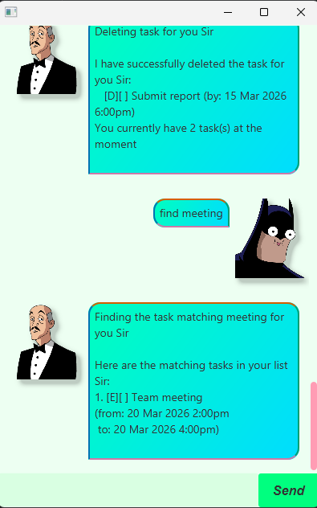
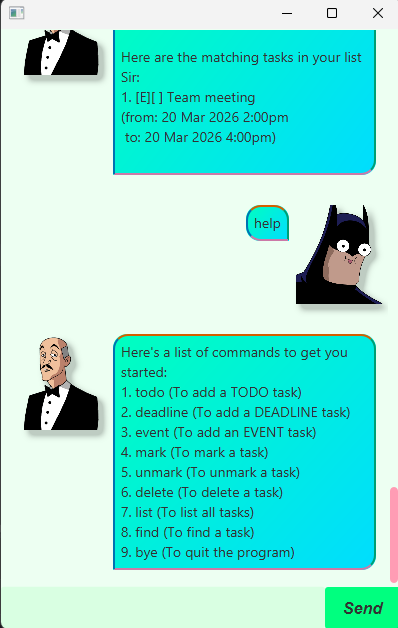
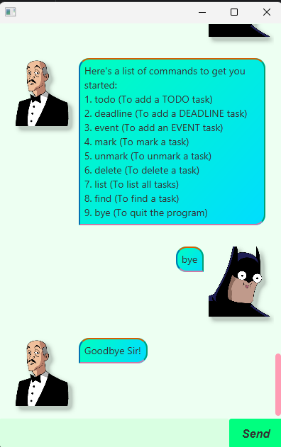

# Alfred

Alfred is a chatbot that helps you manage your tasks efficiently. With Alfred, you can create, view, and organize your todos, deadlines, and events all in one place. Whether you're a busy professional or a student juggling multiple assignments, Alfred is here to keep you on track.


## Table of Contents
- [Features](#features)
- [Quick Start](#quick-start)
- [Installation](#installation)
- [Usage](#usage)
    - [Adding Tasks](#adding-tasks)
    - [Viewing Tasks](#viewing-tasks)
    - [Managing Tasks](#managing-tasks)
    - [Finding Tasks](#finding-tasks)
- [Command Reference](#command-reference)
- [Data Storage](#data-storage)
- [FAQ](#faq)
- [Troubleshooting](#troubleshooting)

## Features

- ✅ Create three types of tasks: todos, deadlines, and events
- ❌ Delete and update tasks with ease
- 📋 View all tasks in an organized list
- 🔍 Search tasks by keyword
- ✔️ Mark tasks as complete
- 💾 Automatic data persistence

## Quick Start

Download the latest `alfred.jar` and run it with Java. Follow the prompts to start managing your tasks right away!

1. Ensure you have Java 17 or above installed
2. Download `alfred.jar` from [releases](https://github.com/bingmybongg/ip/releases)
3. Double-click the jar file or run: `java -jar alfred.jar`
4. Type `help` to see all available commands
5. Start managing your tasks!

## Installation

### Prerequisites
- Java 17 or higher
- [Optional] Minimum 50MB free disk space

### Steps

**Windows:**
```bash
# Download alfred.jar
# Navigate to download folder
java -jar alfred.jar
```

**Mac/Linux:**
```bash
# Download alfred.jar
# Navigate to download folder
chmod +x alfred.jar  # Make executable (optional)
java -jar alfred.jar
```

**First Run:**
On first run, Alfred will create a data folder at `./data/alfred.csv` to store your tasks.

## Usage

### Adding Tasks

#### Todo
Simple tasks without dates.

**Format:** `todo DESCRIPTION`

**Example:**
```
todo Clean the Batmobile
```

**Expected output:**



---

#### Deadline
Tasks with a due date.

**Format:** `deadline DESCRIPTION /by yyyy-MM-dd HHmm`

**Example:**
```
deadline Submit report /by 2026-03-15 1800
```

**Expected output:**



---

#### Event
Tasks with start and end times.

**Format:** `event DESCRIPTION /from yyyy-MM-dd HHmm /to yyyy-MM-dd HHmm`

**Example:**
```
event Team meeting /from 2026-03-20 1400 /to 2026-03-20 1600
```
**Expected output:**



---

### Viewing Tasks

#### List All Tasks
**Format:** `list`

**Example:**
```
list
```

**Expected output:**



---

### Managing Tasks

#### Mark Task as Done
**Format:** `mark INDEX`

**Example:**
```
mark 1
```

**Expected output:**



---

#### Unmark Task
**Format:** `unmark INDEX`

**Example:**
```
unmark 1
```

**Expected output:**



---

#### Delete Task
**Format:** `delete INDEX`

**Example:**
```
delete 2
```

**Expected output:**



---

### Finding Tasks

Search for tasks containing a keyword.

**Format:** `find KEYWORD`

**Example:**
```
find meeting
```

**Expected output:**



---

### Other Commands

#### Help
Display all available commands.

**Format:** `help`

**Expected output:**



---

#### Exit
Save all tasks and exit the application.

**Format:** `bye`

**Expected output:**



---

## Command Reference

| Command | Format | Example |
|---------|--------|---------|
| Add todo | `todo DESCRIPTION` | `todo Buy milk` |
| Add deadline | `deadline DESCRIPTION /by DATE` | `deadline Report /by 2026-03-15 1800` |
| Add event | `event DESCRIPTION /from DATE /to DATE` | `event Meeting /from 2026-03-20 1400 /to 2026-03-20 1600` |
| List tasks | `list` | `list` |
| Find tasks | `find KEYWORD` | `find report` |
| Mark task | `mark INDEX` | `mark 1` |
| Unmark task | `unmark INDEX` | `unmark 1` |
| Delete task | `delete INDEX` | `delete 2` |
| Help | `help` | `help` |
| Exit | `bye` | `bye` |

**Notes:**
- `INDEX` refers to the task number shown in the `list` command (1-based indexing)
- `DATE` format is `yyyy-MM-dd HHmm` (e.g., 2026-03-15 1800 for March 15, 2026, 6:00 PM)
- Task descriptions can contain spaces and special characters

## Data Storage

### File Location
Tasks are automatically saved to `./data/alfred.csv`

### Format
The CSV file uses the following format:
- Todo: `todo,DESCRIPTION,MARKED`
- Deadline: `deadline,DESCRIPTION,MARKED,DATE`
- Event: `event,DESCRIPTION,MARKED,FROM_DATE,TO_DATE`

Where `MARKED` is `1` for completed tasks or `0` for incomplete tasks.

### Manual Editing
⚠️ **Warning:** Editing the CSV file manually may cause data corruption if the format is incorrect. Always backup before manual editing.

### Backup
To backup your tasks:
1. Locate `./data/alfred.csv`
2. Copy the file to a safe location
3. To restore, replace the current CSV with your backup

## FAQ

**Q: What happens if I enter an invalid date format?**

A: Alfred will display an error message with the correct format. Example:


**Q: Can I have tasks with the same description?**

A: Yes, Alfred allows duplicate task descriptions. Each task is treated as a separate entry.

**Q: What if the data file is deleted?**

A: Alfred will create a new empty data file on the next run. Your previous tasks will be lost unless you have a backup.

**Q: Can I use special characters in task descriptions?**

A: Yes, most special characters are supported.

**Q: Is there a limit to the number of tasks?**

A: No hard limit, but performance may degrade with thousands of tasks.

**Q: Must I type "bye" to exit?**

A: Yes, typing `bye` ensures that all tasks are saved properly before exiting. Closing the application without typing `bye` may result in unsaved changes.

## Troubleshooting

### "Unable to access jarfile alfred.jar"
**Solution:** Ensure you're in the correct directory where alfred.jar is located.

### "UnsupportedClassVersionError"
**Solution:** You need Java 17 or higher. Check your version with `java --version`

### Tasks not saving
**Solution:**
1. Check that you have write permissions in the application directory
2. Ensure the `./data` folder exists
3. Run with elevated permissions if needed

### Date parsing errors
**Solution:** Ensure your date follows the exact format: `yyyy-MM-dd HHmm`
- ✅ Correct: `2026-03-15 1800`
- ❌ Wrong: `15-03-2026 6:00PM`
- ❌ Wrong: `2026/03/15 18:00`

### Command not recognized
**Solution:** Type `help` to see all available commands. Commands are case-sensitive and should be lowercase.

Made with ☕ by bingmybongg